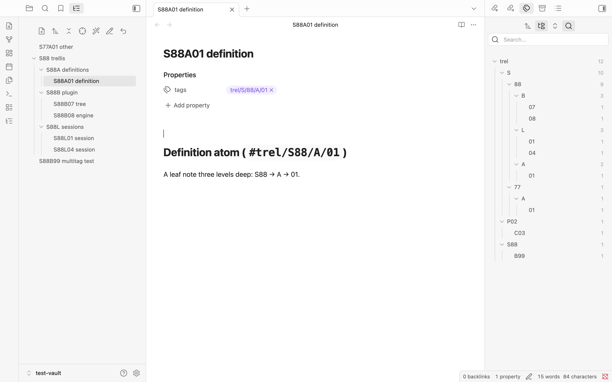
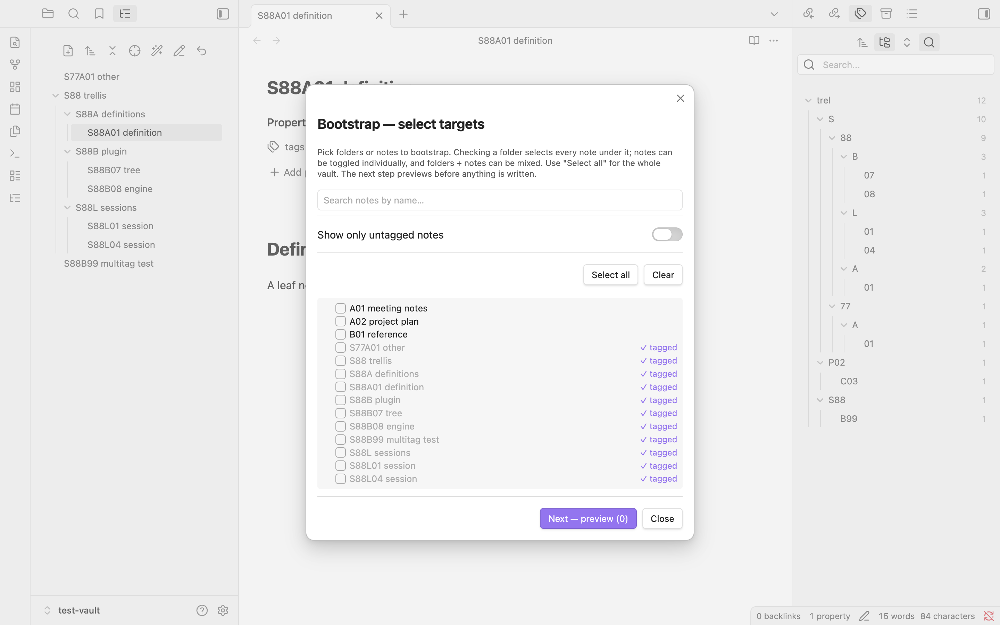
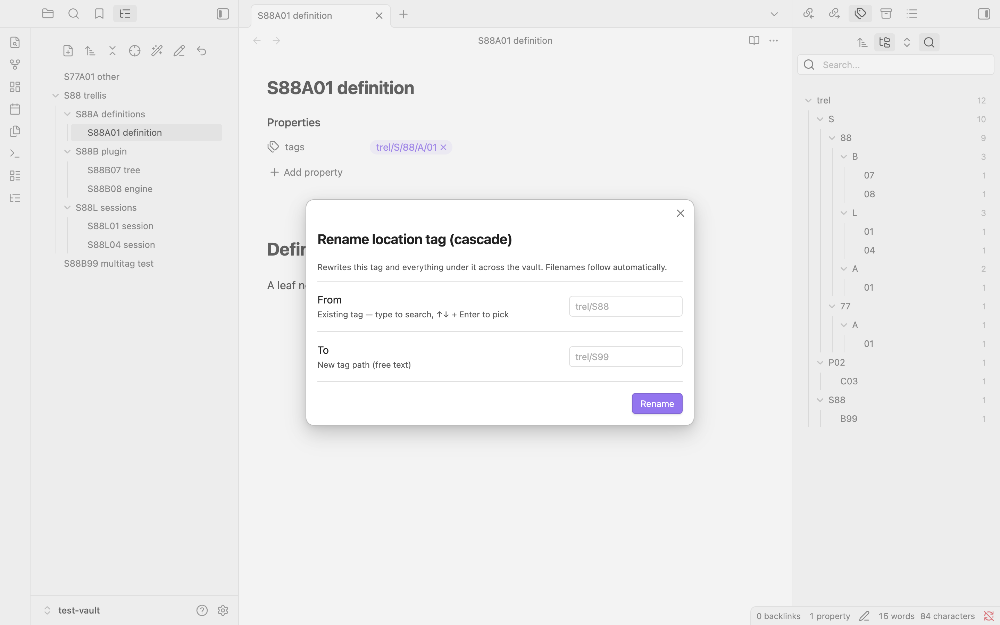
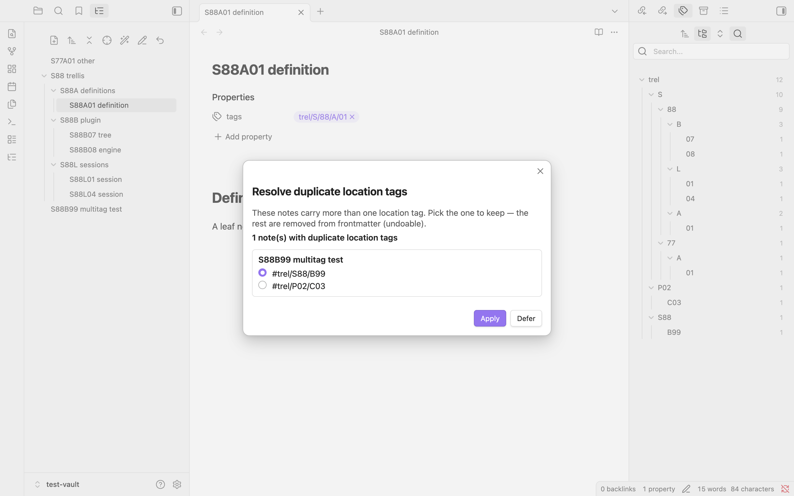
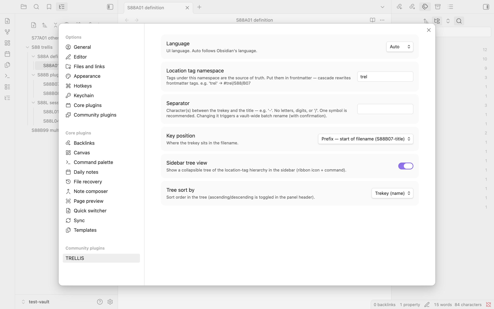

# TRELLIS

[English](README.md) | **한국어**

[Obsidian](https://obsidian.md)용 태그 기반 파일명 동기화 플러그인. 계층형 **위치
태그**를 유일한 진실원(source of truth)으로 두면, TRELLIS가 그 태그를 **파일명
접두사**(*trekey*)로 자동 반영합니다 — 링크는 깨지지 않습니다.

태그 트리에서 노트를 옮기면 파일명 접두사가 따라옵니다. 수동 일괄 이름변경도,
깨진 위키링크도 없습니다.

```
노트에 태그    #trel/S88/B07     →  파일명  S88B07-tree-idea.md
태그 변경      #trel/S88/B99     →  파일명  S88B99-tree-idea.md   (자동)
```



## ✨ 기능

- **단방향 동기화** — 노트의 위치 태그가 바뀌면 파일명 접두사가 그에 맞게
  다시 쓰입니다. 옵시디언의 링크 안전 rename API를 거치므로 위키링크가 자동
  갱신됩니다. 파일명이나 제목을 손으로 바꿔도 태그 기준으로 복원됩니다. 태그가
  항상 진실원입니다. 위치 태그는 frontmatter에 두세요 — cascade와 bootstrap이
  읽고 다시 쓰는 대상입니다. 노트 하나 = 위치 태그 하나(그 이상은 알림으로
  표시).
- **Cascade 이름변경** — 태그 하나를 바꾸면 그 하위 전체가 따라옵니다. 상위
  계층을 새로 끼워 넣는 변경도 처리합니다. 파일명·위키링크가 함께 따라옵니다.
- **사이드바 트리 뷰** — 실제 폴더 없이, 태그 계층을 접고 펼 수 있는 폴더 같은
  트리로 보여줍니다.
- **Bootstrap** — 파일명 접두사는 있지만 아직 태그가 없는 기존 볼트를
  온보딩합니다. 체크박스 트리로 범위를 고르고(볼트 전체·폴더·개별 노트, 드래그로
  훑어 선택, 검색, 태그 없는 노트만 보기), 드라이런으로 미리 보고, 진행률을
  지켜보며, 한 번에 되돌릴 수 있습니다. 파일별 오류가 격리되어 노트 하나가
  전체를 멈추지 않습니다.
- **중복 위치 태그 정리** — 노트가 같은 네임스페이스의 위치 태그를 둘 이상
  가지면 TRELLIS가 이를 표시하고 정리 명령을 제공합니다. 남길 태그를 고르면
  나머지는 제거됩니다. 대량 볼트를 위해 배치 처리되며 되돌리기를 지원합니다.
- **구분자 일괄 변경** — 설정에서 구분자를 바꾸면 볼트 전체에서 trekey 경계
  구분자만 교체됩니다(제목 안의 같은 기호는 보존). 되돌리기 지원.
- **다국어(i18n)** — 옵시디언 언어에 맞춰 한국어/영어 UI 자동 전환.

## 📦 설치

**수동 (현재):**

1. 최신 [릴리스](../../releases)에서 `main.js`·`manifest.json`·`styles.css`를
   받습니다.
2. 볼트의 `.obsidian/plugins/trellis/` 폴더에 넣습니다.
3. **설정 → 커뮤니티 플러그인**에서 활성화합니다.

*(커뮤니티 플러그인 마켓 등록은 0.1.0에서 예정.)*

## 🚀 사용법

1. **노트에 태그** — frontmatter에 위치 태그(예: `tags: [trel/S88/B07]`)를 넣으면
   파일명 접두사가 `S88B07`로 자동 동기화됩니다.
2. **계층 변경** — 명령 팔레트나 노트 우클릭에서 **"위치 태그 이름 변경
   (cascade)"** 실행 — 파일명·위키링크가 따라옵니다.
3. **트리 뷰** — 리본 아이콘으로 사이드바 트리를 엽니다.
4. **기존 볼트 온보딩** — **"Bootstrap"** 실행으로 파일명 접두사에서 태그를
   역산합니다(범위 선택 → 드라이런 → 적용).
5. **중복 정리** — **"중복 위치 태그 점검"** 실행으로 위치 태그가 둘 이상인
   노트를 찾아 남길 것을 고릅니다.
6. **구분자 변경** — 설정에서 바꾸면 확인 후 볼트 전체에 적용됩니다.

## 📸 스크린샷

**Bootstrap — 온보딩 대상 고르기.** 이미 태그된 노트는 완료로 표시되고, 태그
없는 노트를 선택할 수 있습니다(볼트 전체·폴더·개별 노트).



**Cascade 이름변경 — 하위 전체 이동.** 태그 하나를 바꾸면 그 아래 모든 노트가
파일명·위키링크까지 따라옵니다.



**중복 정리 — 노트당 위치 하나.** 노트에 위치 태그가 둘 이상이면 남길 것을
고르고 나머지는 제거합니다(되돌리기 가능).



## ⚙️ 설정



- **위치 태그 네임스페이스** — 어떤 태그를 진실원으로 볼지 (예: `trel`)
- **구분자** — trekey와 제목 사이 문자 (예: `-`)
- **키 위치** — 파일명의 접두(앞) 또는 접미(뒤)
- **사이드바 트리 뷰** — 켬 / 끔
- **트리 정렬** — trekey / 수정 시간 / 생성 시간
- **언어** — 자동 / 한국어 / 영어

## 🔧 호환성

옵시디언 **1.4.0** 이상 필요.

## 🧱 설계

TRELLIS는 **형식 불가지론적(format-agnostic)**입니다 — trekey가 무엇을 의미하는지
정의하지 않고, 오직 동기화 유지 방법만 담당합니다. 변환 로직은 `trekey.ts`(순수
함수·유닛 테스트)에 있고, `main.ts`는 옵시디언 연결부입니다. 파일명 키 모델은
슬롯 + 구분자의 위치 배열이라, 단일 키 기본값은 2슬롯 `[tag, name]`의 특수한
경우일 뿐이며 코어를 새로 쓰지 않고도 멀티 키로 확장할 수 있습니다.

## 🛠 개발

```bash
npm install
npm run dev      # watch 빌드
npm run build    # 타입체크 + 프로덕션 빌드 → main.js
npm test         # 변환 로직 유닛 테스트
```

실제 노트에 적용하기 전에, 엔진을 안전하게 시험할 임시 볼트를 만들어 쓰세요.

## 📄 라이선스

[MIT](LICENSE)

## 💡 왜 만들었나

큰 평면(flat) 볼트를 관리하면서, 폴더 *없이* 폴더 같은 계층을 갖고 싶었습니다 —
태그를 유일한 진실원으로 두고 파일명은 자동으로 맞춰지도록. 계층에서 노트를
옮기는 일이 수동 이름변경이나 깨진 링크를 뜻해선 안 되고, 태그가 나머지 전부를
움직여야 한다고 생각했습니다.
