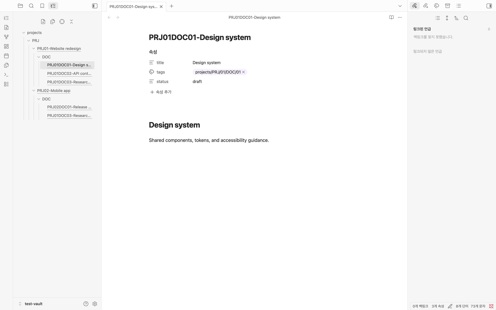
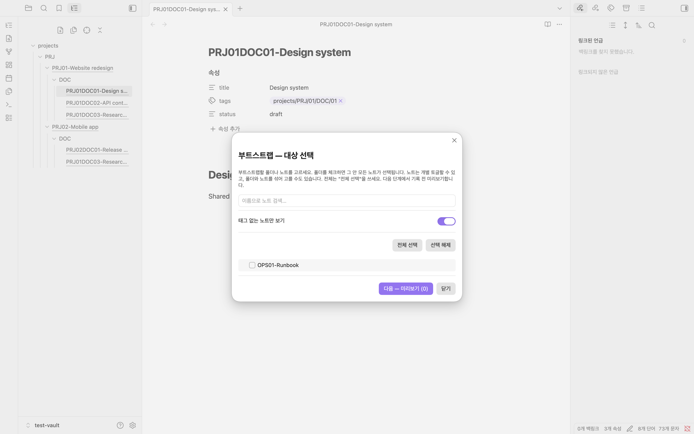
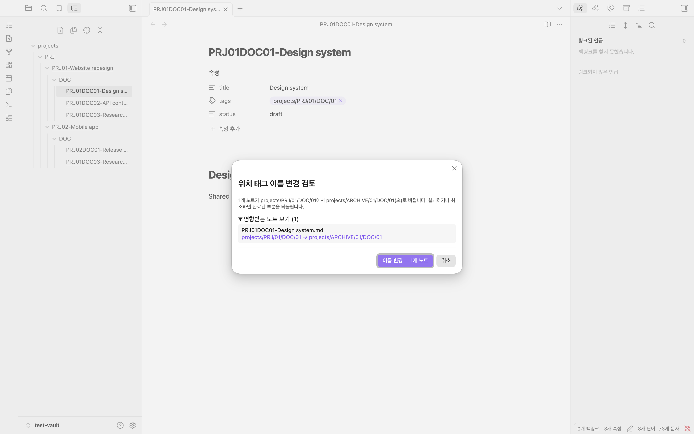
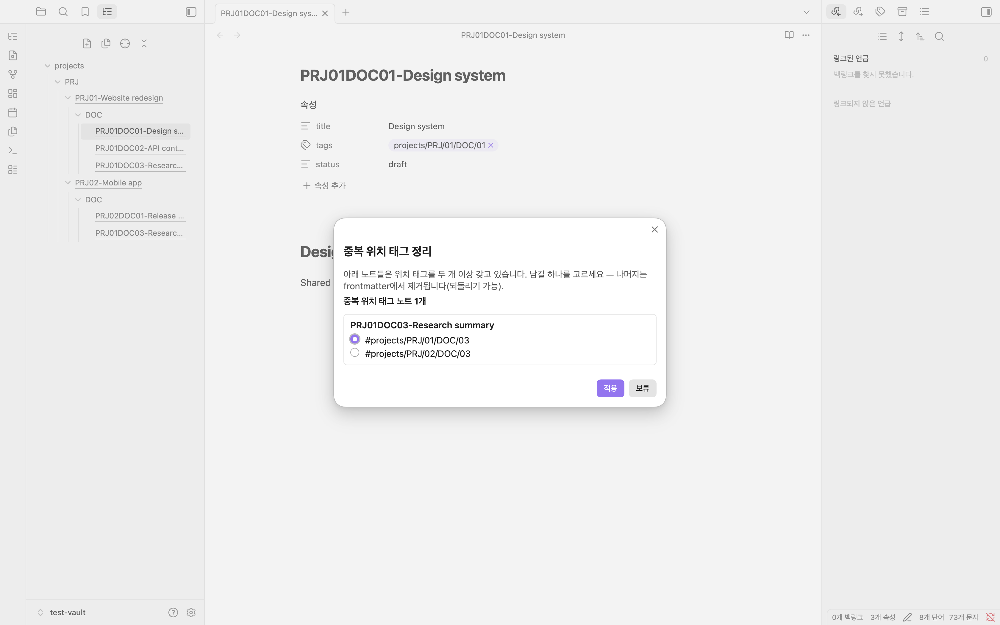
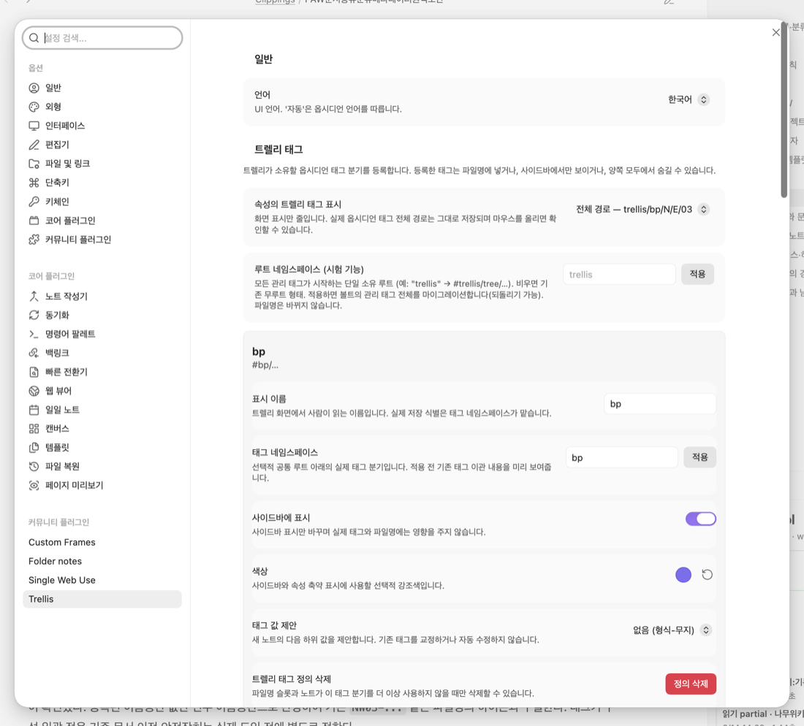

# Trellis

**English** | [한국어](README.ko.md)

[](https://github.com/CocaPls/obsidian-trellis/actions/workflows/ci.yml)
· [Community plugin page](https://community.obsidian.md/plugins/trellis)

Trellis uses hierarchical **managed tags** to manage filenames across notes.
Preview bulk changes, then rename through Obsidian so internal links stay
updated.

```text
tag  #projects/PRJ/01/DOC/01  →  file  PRJ01DOC01-meeting-notes.md
tag  #projects/PRJ/01/DOC/02  →  file  PRJ01DOC02-meeting-notes.md  (automatic)
```



## Why Trellis

Renaming tag-derived filename parts by hand is tedious and error-prone. Trellis
keeps those parts consistent across notes while leaving unrelated notes and free
filename parts alone.

## How it works

For `PRJ01DOC01-meeting-notes.md`:

- `PRJ01DOC01` is the managed **filename code**, built from
  `#projects/PRJ/01/DOC/01`.
- `-` is the configurable boundary between the code and title.
- `meeting-notes` is your free **title**; Trellis does not rewrite it.

The tag is authoritative. Change the tag and the code follows. Edit the managed
code by hand and Trellis restores it from the tag on the next sync.

## Highlights

- **Pauseable filename sync** through Obsidian's link-safe rename, with an exact
  drift preview before resuming and duplicate/collision guards.
- **Sidebar tree** built from tags rather than folders, with note and tag modes,
  new-note creation, current-note reveal, collapse controls, branch visibility,
  and per-managed-tag colors.
- **Subtree moves** that preview and migrate a location and every descendant,
  including filenames and wikilinks, with rollback and undo.
- **Existing-vault import** that derives tags from filename codes for a selected
  vault, folder, or note scope, with dry run, progress controls, and undo.
- **Safe filename structures** with sparse tag/name slots, symbol/space/empty
  gaps, custom portable separators, hierarchy display, optional slot wrappers,
  and filename-only underscore-to-space formatting.
- **Managed-tag registry and inventory** independent from filename projection,
  including search, reversible archiving, sidebar-only tags, combinations,
  drift, and collision reporting.
- **Korean and English UI**, following Obsidian's language by default.

## Install

**From Obsidian:** Settings → Community plugins → Browse, search for *Trellis*,
then install and enable it.

**Manually:** download `main.js`, `manifest.json`, and `styles.css` from the
[latest release](https://github.com/CocaPls/obsidian-trellis/releases/latest),
put them in `your-vault/.obsidian/plugins/trellis/`, and enable the plugin.

## Quick start

1. Add a location tag in frontmatter, for example
   `tags: [projects/PRJ/01/DOC/01]`.
2. Trellis syncs the filename code to `PRJ01DOC01`.
3. Open the tree from the ribbon and move through the hierarchy.
4. Use **Move location and descendants** to relocate a whole subtree.
5. Use **Import existing filenames** to onboard notes that already have codes.
6. Review every bulk preview before applying it; completed operations retain an
   undo record where supported.

The configured namespace is active immediately. Use a namespace that is not
already assigned to unrelated tags: every descendant tag under it is
intentionally treated as a managed location.

## Flexible filename structures

The single-code path remains the default, but the same staged editor can model
multiple optional projections without switching to a separate advanced mode.

- **Multiple tag slots** combine more than one managed tag with one free title:

  ```text
  #projects/PRJ/01 + #areas/ENG/02  →  PRJ01-project-overview--ENG02
  ```

  Each tag slot has its own registered source, hierarchy display, optional
  wrapper, and filename-only underscore formatting. The stored Obsidian tag is
  never rewritten by that display option. Each gap can be a symbol, one space,
  or nothing. Applying a structure change requires a preview; ambiguous or
  colliding layouts are rejected. The name slot is optional. With a global
  `[A]-[B]-[C]` structure, each note may carry only the tags it needs: `A`,
  `A-B`, `A-C`, and `B-C` coexist while
  omitted slots and their separators collapse automatically. Removing the
  name slot shows an explicit free-name loss warning, and exact filename
  collisions block the structure change.
- **Root namespace** places every managed tag below a shared root such as
  `#work/projects/...` without adding that root to filenames. Changes are migrated
  behind confirmation and are undoable.
- **Value suggestions** can follow a configurable sequence, date, local/UTC
  timestamp, or alternating alphabet/number pattern when creating a note.

Filename sync, the nested tag tree, and subtree moves recognize every registered
Trellis tag. A definition can be filename-bearing, sidebar-only, or hidden from
the sidebar. The classic notes-only tree lets you choose one visible tag as its axis.
Subtree moves may also transfer a reviewed branch between definitions, which
supports deliberate hierarchy split/merge workflows.
Definitions no longer in active use can be archived after they leave the filename
structure. Their existing tags remain recognizable for cleanup, while the
definition leaves active choices and the sidebar until restored.
Import existing filenames still reads the primary outer code because arbitrary
multi-slot filenames are not always reversibly parseable without their tags.

## Screenshots

**Import existing filenames — choose exactly what to onboard.**



**Move a location and its descendants — preview the whole subtree.**



**Duplicate cleanup — keep one location per namespace.**



## Settings



The settings use two focused sections: general behavior, and filename/tags. The
latter combines a searchable managed-tag browser with a compact horizontal slot
order and one selected-item editor. It also covers filename synchronization,
compact Properties labels, and a live per-definition inventory with combinations,
drift, and filename collisions.

Vault-wide setting changes are staged first. Trellis shows the exact affected
files, checks collisions and parse ambiguity, then applies through Obsidian's
rename API. A cancel or failure rolls the transaction back.

## Automation for AI and scripts

Trellis exposes an experimental, in-process `describe / inspectNote → planChange
→ applyChange` surface for tools that already run inside Obsidian. It opens no
network, REST, URI, or MCP endpoint. Plans are rejected if the note or filename structure
changed after inspection.

See [Guarded automation](docs/automation.md) for examples, result shapes, and
safety boundaries.

## Compatibility, privacy, and safety

Requires Obsidian **1.8.7** or newer. Desktop and mobile.

Trellis works locally through Obsidian's public vault APIs. It makes no network
requests, collects no telemetry, shows no ads, requires no account, and does not
access files outside the current vault.

Bulk filename and tag changes can affect many notes. Review the preview and keep
a normal vault backup as you would for any bulk-editing tool.

## Development

The pure filename-structure logic lives in [`src/tagkey.ts`](src/tagkey.ts);
[`src/main.ts`](src/main.ts) connects it to Obsidian. See
[CONTRIBUTING.md](CONTRIBUTING.md) for the local build, tests, and contribution
workflow.

## Part of

Trellis is the identification component of
[everything-in-obsidian](https://github.com/CocaPls/everything-in-obsidian), a
personal hub of pluggable systems for operating an Obsidian vault with a CLI AI.
Trellis works fully on its own; the hub is optional context.

## License

[MIT](LICENSE)
